# Architecture Diagrams

This document contains visual representations of the Receipt Processor system architecture.

## System Overview

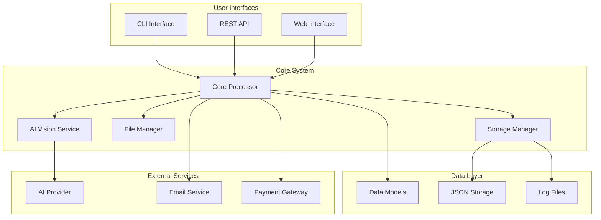

## Data Flow Architecture

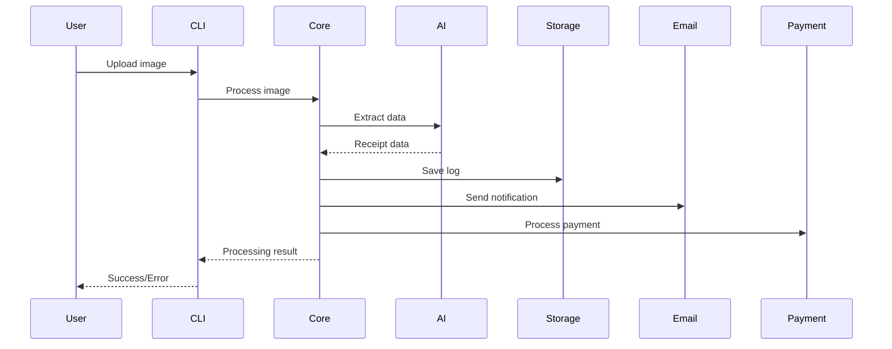

## Component Architecture

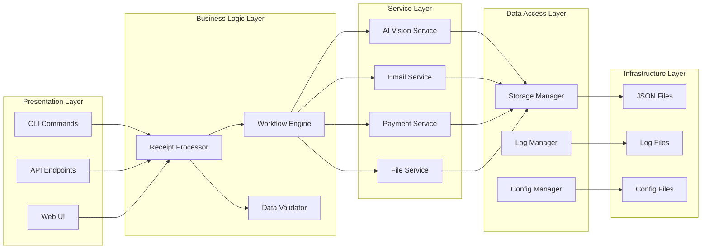

## Processing Pipeline

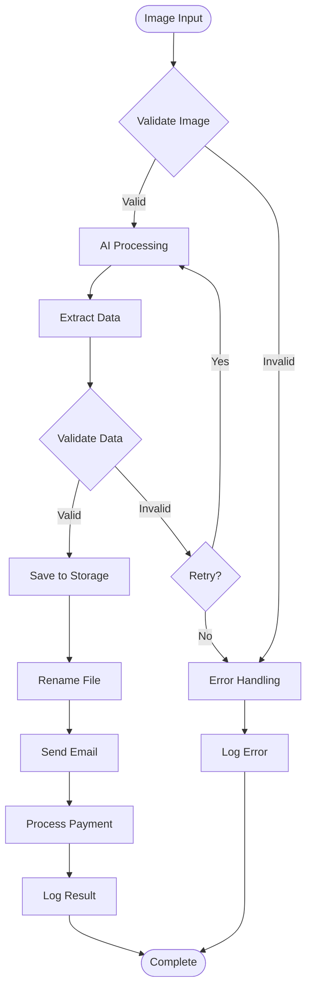

## Error Handling Architecture

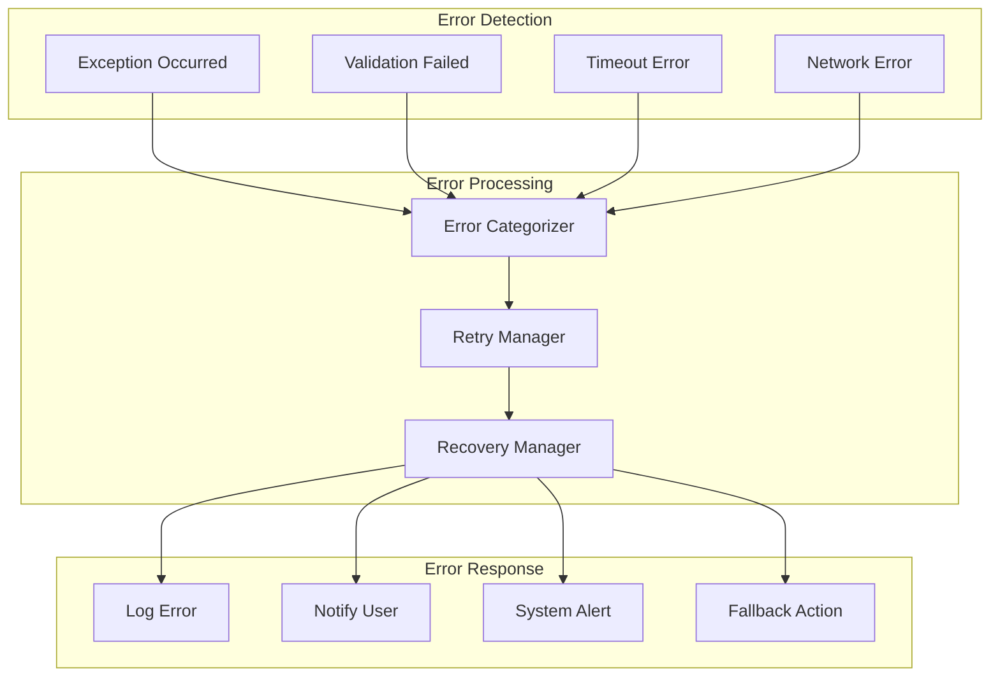

## Storage Architecture

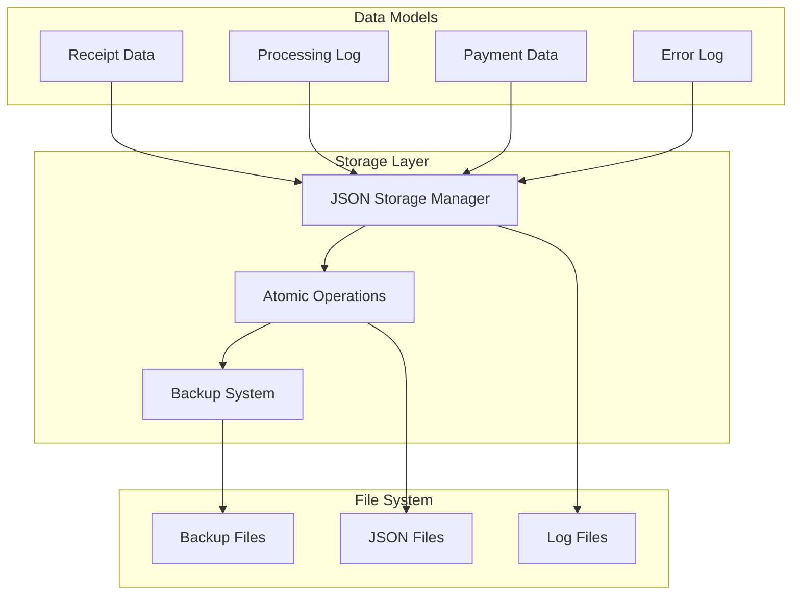

## Monitoring Architecture

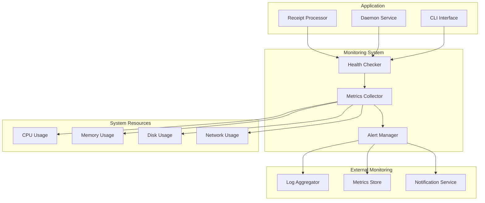

## Deployment Architecture

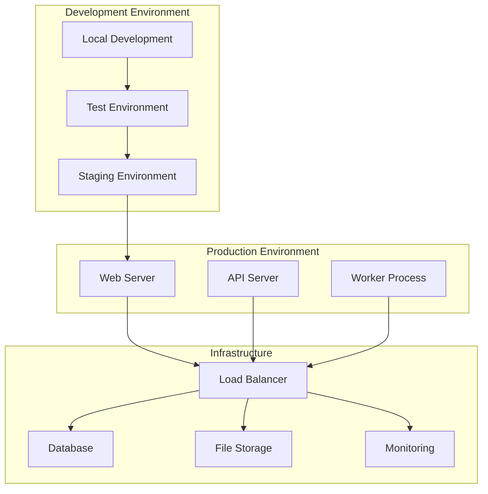

## Security Architecture

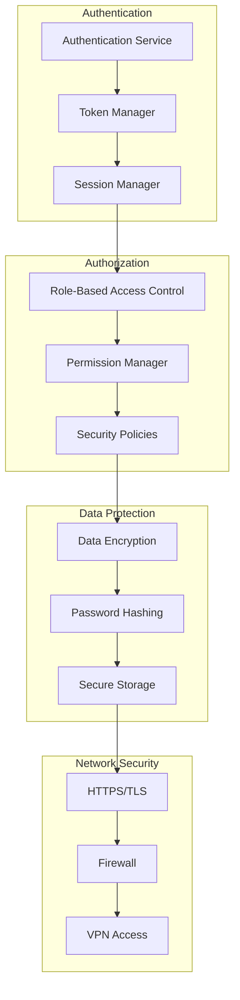

## Integration Architecture

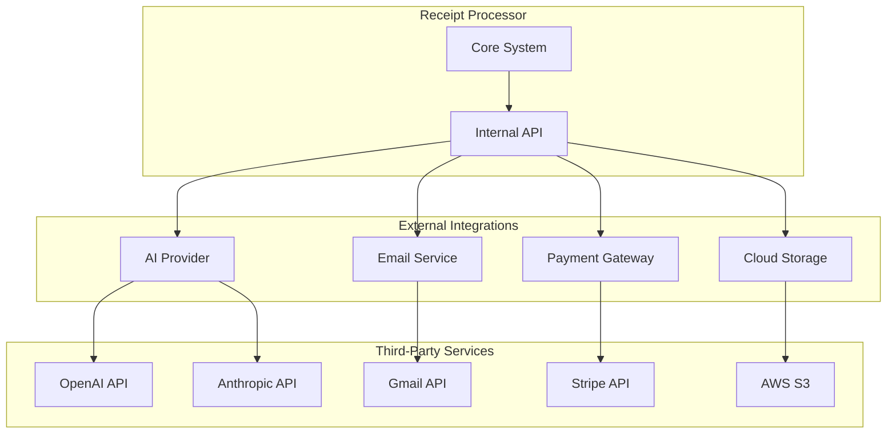

## Performance Architecture

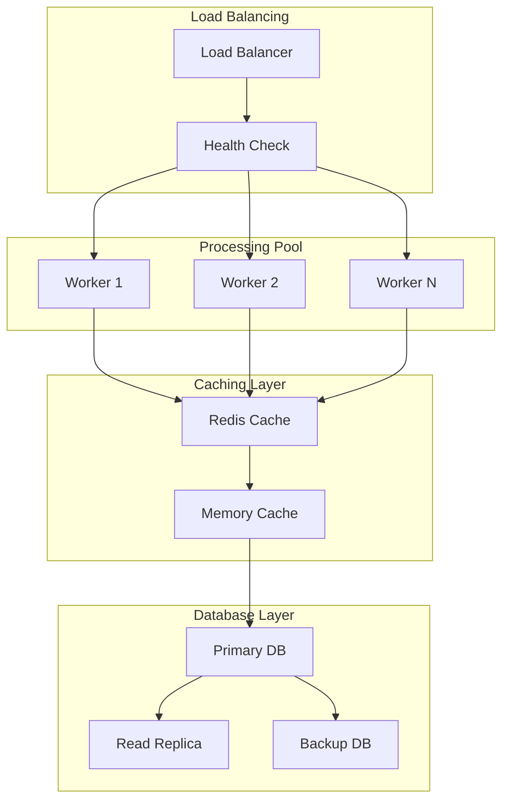

These diagrams provide a comprehensive view of the Receipt Processor system architecture, showing how different components interact and how data flows through the system.
